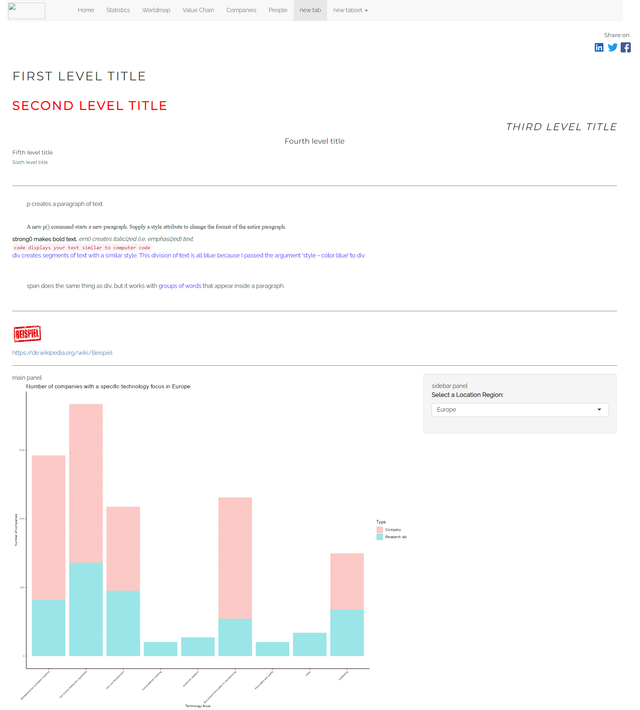
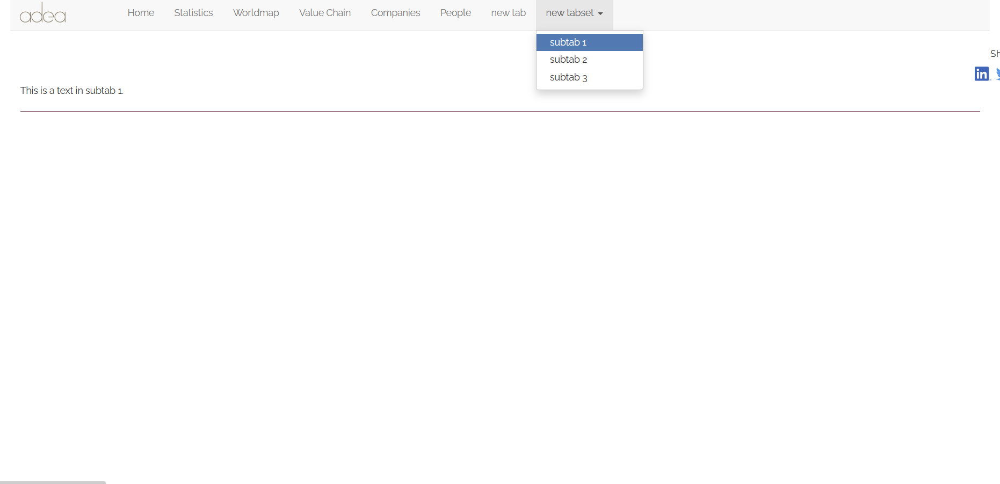

```{r setup, include=FALSE}
knitr::opts_chunk$set(echo = TRUE)
```

# Preview

In this R Markdown document you can play around with the code of the
ui.R and the server.R files in the my_app folder to change the
appearance of the Shiny application or to add new functionality to this
application before adding the changes in the original code. You can
modify this code without affecting the original code of the web
application. This document already contains some examples how to create
new tabs or even a whole new tabset, how to to lay out the user
interface and then add text, images, and other HTML elements to your
Shiny application and how to add new relevant plots.





Before you can use this R Markdown document please run the code in the
data_merging_modifiable_version.R, final_data_prep_modifiable_version.R
and google_data_merged_prep_modifiable_version.R first.

## Preparations

```{r}
# Libraries ------------------------------------------------------------------

# for UI

library(DT) # create data.table 
library(shinythemes) 
library(shiny) # create shiny app 
library(shinyWidgets) 
library(shinydashboard)
library(collapsibleTree) 
library(shinycssloaders) 
library(tigris)
library(rintrojs) 
library(htmltools) 
# remotes::install_github("deepanshu88/summaryBox") 
library(summaryBox)
#remotes::install_github("etiennebacher/shinyfullscreen")
library(shinyfullscreen)

# for server

library(devtools) 
library(dplyr) 
library(tidyverse) 
library(treemap) #create value chain 
#install_github("timelyportfolio/d3treeR")
library(d3treeR) # make the treemap interactive 
library(leaflet) # create world map 
library(maps) # create world map 
library(plotly)
library(viridis) # virids package for the color palette 
library(mapproj)
library(ggrepel) 
library(ggiraph) # make the world map clickable


# 1. Load the dataset with CM company and all alternative protein companies ----

source(file = "~/InnoLab-Adea/my_app_modifiable_version/final_data_prep_modifiable_version.R")
source(file = "~/InnoLab-Adea/my_app_modifiable_version/questionnaire_merged_modifiable_version.R")


# 2. Design adjustments

# Define color palette for the exploratory statistics

temperatureColor <- "#E4C49D" 
priceColor <- "#823F54"

# Define function to change font size of treemap from <https://zhiyang.netlify.app/post/treemap/> 

style_widget <- function(hw=NULL, style="", addl_selector="") { stopifnot(!is.null(hw),
inherits(hw,"htmlwidget"))

    # use current id of htmlwidget if already specified
    elementId <- hw$elementId
    if(is.null(elementId)) {# borrow htmlwidgets unique id creator
      elementId <- sprintf('htmlwidget-%s',
                           htmlwidgets:::createWidgetId())
      hw$elementId <- elementId}

    htmlwidgets::prependContent(hw, htmltools::tags$style(sprintf("#%s %s {%s}",
                                                                  elementId,
                                                                  addl_selector,
                                                                  style)
    )
    )

}
```

## 1. User interface

```{r}
ui <- fluidPage(
  navbarPage(title = div(img(src="adea_logo.svg", height='40', width='90', style="margin: -10px -10px; position :relative; display right-align;")),
             tags$head(tags$style(HTML(".navbar-nav>li:nth-child(11) {float: right; right: -750px;}"))), # contact-tab on right side 
             id = "panels", # for setting internal hyperlinks 
             includeCSS("www/style/style_new.css"), #my_app_modifiable_version/

             # tab panel 1 - Home ---------------------------------------------
             
             tabPanel("Home",
                      #icon = tags$img(src="https://cdn-icons-png.flaticon.com/128/263/263115.png", height='30', width='30', style="margin-bottom: 20px;"), 
                      
                      fluidRow(box(width=6, 
                                   title=h3("Find insights about the Cultured Meat Industry", style = 'font-size:42px;color:black;'),
                                   br(),
                                   span("Get a full overview about players in the market, the value chain and exploratory statistics about the newly evolving Cultured Meat market!", style = 'font-size:16px;'), 
                                   br(),
                                   br(),
                                   actionButton("link_Home_to_Stat", "Get started", class = "btn-lg",
                                                style="color: #fff; background-color: #823F54; border-color: #823F54",
                                                width = "200px")),
                               box(width = 6, img(src='steak.jpg', height='300', width='500', align = "right"))),
                      fluidRow(box(height="100px")),
                      
                      fluidRow(summaryBox2(width=4, icon="fas fa-users", "Cultured Meat Experts", "10+", style="winterwheat"),
                               summaryBox2(width=4, icon="fas fa-location-dot", "Countries", "30+", style="winterwheat"),
                               summaryBox2(width=4, icon="fas fa-building", "Cultured Meat Companies", "180+", style="winterwheat")),
                      fluidRow(box(height="100px")),
                      
                      fluidRow(box(width=2),
                               box(width=5, img(src='meat.png', height='400', width='400', align = "left")),
                               box(width=5, 
                                   title=h3("We Provide Many", span(strong("Features"), style="color: #823F54"),  "You Can Use", 
                                            style = 'font-size:42px;color:black;'), 
                                   br(),
                                   span("You can explore the cultured meat industy by scrolling through our interactive and easy-to-use overview.", 
                                        style = 'font-size:16px;'),
                                   br(),
                                   p(span(icon("circle-check"), "Explore all companies in the value chain"), style = 'font-size:16px;'),
                                   p(span(icon("circle-check"),"Find your worldwide competitors and suppliers"), style = 'font-size:16px;'),
                                   p(span(icon("circle-check"),"Interactive Statistics"), style = 'font-size:16px;'),
                                   p(span(icon("circle-check"),"Understand more about Cultured Meat"), style = 'font-size:16px;'))),
                      fluidRow(box(height="100px"))
             ),
             
             # tab panel 2 - Statistics ----------------------------------
             
             tabPanel("Statistics",
                      span("This section provides you an overview of the cultured meat market.", style = 'font-size:16px;'),
                      br(),
                      br(),
                      hr(style="border-color: #823F54;"),
                      
                      tabsetPanel(tabPanel("Distribution of cultured meat companies over time",
                                           # Sidebar layout with input and output definitions 
                                           sidebarLayout(#Sidebar panel for inputs 
                                             sidebarPanel(# Select variable for y-axis
                                               selectInput(inputId = "y",
                                                           label = "Select y-axis for the first figure:",
                                                           choices = c("Number of new cultured meat companies" = "new",
                                                                       "Total number of cultured meat companies" = "total"),
                                                           selected = "new")
                                             ), 
                                             # Output:  
                                             mainPanel(# ggplot2 species charts section
                                               plotOutput("barplot1") %>% withSpinner(color = "green"),
                                               br(),
                                               br(),
                                               plotOutput("barplot2") %>% withSpinner(color = "green"),
                                               fullscreen_those(items = list("barplot1", "barplot2"))) #mainPanel
                                           ) #sidebarLayout
                      ),
                      
                      tabPanel("Distribution of cultured meat companies by selected variables",
                               # Sidebar layout with input and output definitions 
                               sidebarLayout(# Sidebar panel for inputs 
                                 sidebarPanel(# Select variable for x-axis
                                   selectInput(inputId = "x",
                                               label = "Select variable for the third figure:",
                                               choices = c("Country" = "Country",
                                                 "Operating Regions" = "Operating.Regions",
                                                 "Technology Focus" = "Technology.Focus",
                                                 "Protein Category" = "Protein.Category",
                                                 "Company Focus" = "Company.Focus",
                                                 "Product Type" = "Product.Type",
                                                 "Animal Type Analog" = "Animal.Type.Analog",
                                                 "Location Regions" = "Location.Regions"),
                                               selected = "Country"),
                                 ), 
                                 # Output:  
                                 mainPanel(plotOutput("barplot3", height = 800) %>% fullscreen_this() %>% withSpinner(color = "green" )
                                 )
                               )
                      ) 
                      )
             ), 
             
             # tab panel 3 - Worldmap ----------------------------------
             
             tabPanel("Worldmap",
                      span("You are interested in the cultured meat and wanna see how many cultivated meat companies are there in each country?
                            Use the map to search for your answer. Click on any one of them to get more detailed information.", style = 'font-size:16px;'),
                      br(),
                      br(),
                      span(strong("Tutorial: "), "Click and drag to zoom in, double click to zoom out. Please click on a bubble in the worldmap to get more insights in the table below", style = 'font-size:16px;'),
                      br(),
                      br(),
                      actionButton("link_WM_to_VC", ">> Go to Value chain", style="float:right; color: #fff; background-color: #823F54; border-color: #823F54"),
                      br(),
                      br(),
                      hr(style="border-color: #823F54;"),
                      
                      h1("Distribution of the global players in the cultured meat market"),
                      mainPanel(plotlyOutput("mapplot", width = "150%",height = "700px") %>% withSpinner(color = "green"),
                                tags$h2("Company lists of selected country"),
                                
                                dataTableOutput("maptable", width = "150%",height = "600px") %>% withSpinner(color = "green")
                      )
             ),
             
             
             # tab panel 4 - Value chain --------------------------------------
             
             tabPanel("Value Chain",
                      span("In this section you can have a look at what companies and how many cultured meat companies are there in each step of the value chain.", style = 'font-size:16px;'),
                      br(),
                      br(),
                      fluidRow(box(width=12, img(src='valueChain.png', height='120', width='900'), align="center")),
                      br(),
                      br(),
                      span(strong("Tutorial: "), "In order to start the interactive plot
                         please select at least one region and one country.
                         When the plot pops up you can click on a square to get
                         to the next level of the plot. Continue this activity
                         until you reach the last level of this plot to see 
                         the related companies. In order to get back to the 
                         previous level please click on the bar title.", style = 'font-size:16px;'),
                      br(),
                      br(),
                      actionButton("link_VC_to_CI", ">> Go to Company information", style="float:right; color: #fff; background-color: #823F54; border-color: #823F54"),
                      actionButton("link_VC_to_WM", "<< Go back to Wordmap", style="float:left; color: #fff; background-color: #823F54; border-color: #823F54"),
                      br(),
                      br(),
                      hr(style="border-color: #823F54;"),
                      
                      sidebarLayout(sidebarPanel(fluidRow(column(12,
                                                                 selectInput("regionselect",
                                                                             label = "Select regions:",
                                                                             choices = c("North America","Europe","Africa/Middle East","Asia Pacific","Latin America","Australia/New Zealand",""), 
                                                                             selected = "North America",multiple = T)
                      ),
                      column(12,
                             selectInput("countryselect",
                                         label = "Select countries:",
                                         choices = c("Argentina","Australia", "Austria", "Belgium",
                                                     "Brazil", "Canada", "Chile", "China",
                                                     "Croatia","Czech Republic","Denmark","Estonia",
                                                     "France","Germany","Iceland","India",
                                                     "Ireland","Israel","Italy","Japan",
                                                     "Mexico","Netherlands","New Zealand","Norway",
                                                     "Poland","Portugal","Russia","Scotland",
                                                     "Singapore","South Africa","South Korea","Spain",
                                                     "Switzerland","Turkey","United Kingdom","United States"),
                                         selected = "United States",
                                         multiple = T)
                      ),
                      column(12,
                             span("Remark: To reselect a choice please click on the delete button on your keyboard")),
                      column(12,
                             tableOutput('vcdis_countrytable')%>% withSpinner(color = "green"))
                      )
                      ),
                      mainPanel(fluidRow(column(6,
                                                actionButton("plot_full", "Show plot in fullscreen", style="float:left; color: #fff; background-color: #823F54; border-color: #823F54"),
                                                br(), br(),
                                                uiOutput("valuechain_countplot") %>% fullscreen_this(click_id = "plot_full") %>% withSpinner(color = "green")  
                      ) 
                      
                      )
                      )           
                      )
             ),
             
             # tab panel 5 - Company profile ----------------------------------
             
             tabPanel("Companies",
                      span("Remark: If your company is not listed here, don't hesitate to ",
                           actionLink("link_CI_to_Contact", "contact"),
                           "us or fill out the ", 
                           actionLink("link_CI_to_questionaire1", "form"), 
                           " to add your company to this list.", style = 'font-size:16px;'),
                      br(),
                      br(),
                      actionButton("link_CI_to_VC", "<< Go back to Value chain", style="float:left; color: #fff; background-color: #823F54; border-color: #823F54"),
                      actionButton("link_CI_to_EI", ">> Go to Employee information", style="float:right; color: #fff; background-color: #823F54; border-color: #823F54"),
                      br(),
                      br(),
                      hr(style="border-color: #823F54;"),
                      
                      sidebarLayout(sidebarPanel(selectInput("Company",                       
                                                             label = "Select company",
                                                             choices = data_CM[,-c(3,10,14)]$Company)
                      ),
                      mainPanel(uiOutput("text0"),
                                fluidRow(box(width=3, strong("Type:")), box(width=8, uiOutput("text1"))),
                                fluidRow(box(width=3, strong("Description:")), box(width=8, uiOutput("text2"))),
                                fluidRow(box(width=3, strong("Founders:")), box(width=8, uiOutput("text3"))),
                                fluidRow(box(width=3, strong("Year Founded:")), box(width=8, uiOutput("text4"))),
                                fluidRow(box(width=3, strong("Contact:")), box(width=8, uiOutput("text5"))),
                                fluidRow(box(width=3, strong("Website:")), box(width=8, uiOutput("text6"))),
                                fluidRow(box(width=3, strong("State:")), box(width=8, uiOutput("text7"))),
                                fluidRow(box(width=3, strong("City:")), box(width=8, uiOutput("text8"))),
                                fluidRow(box(width=3, strong("Country:")), box(width=8, uiOutput("text9"))),
                                fluidRow(box(width=3, strong("Locations Regions:")), box(width=8, uiOutput("text10"))),
                                fluidRow(box(width=3, strong("Operating Regions:")), box(width=8, uiOutput("text11"))),
                                fluidRow(box(width=3, strong("Technology Focus:")), box(width=8, uiOutput("text12"))),
                                fluidRow(box(width=3, strong("Company Focus:")), box(width=8, uiOutput("text13"))),
                                fluidRow(box(width=3, strong("Product Type:")), box(width=8, uiOutput("text14"))),
                                fluidRow(box(width=3, strong("Animal Type Analog:")), box(width=8, uiOutput("text15"))),
                                fluidRow(box(width=3, strong("Ingredient Type:")), box(width=8, uiOutput("text16"))),
                                fluidRow(box(width=3, strong("Parent Company:")), box(width=8, uiOutput("text17"))),
                                fluidRow(box(width=3, strong("Researcher Name:")), box(width=8, uiOutput("text18"))),
                                fluidRow(box(width=3, strong("Position:")), box(width=8, uiOutput("text19"))),
                                fluidRow(box(width=3, strong("Host Institution:")), box(width=8, uiOutput("text20"))),
                                fluidRow(box(width=3, strong("Research focus:")), box(width=8, uiOutput("text21"))),
                                fluidRow(box(width=3, strong("Collaboration opportunities:")), box(width=8, uiOutput("text22"))))
                      )
             ),
             
             # tab panel 6 - Employee profile ----------------------------
             
             tabPanel("People",
                      span("Remark: If you want to add your profile to our webpage, don't hesitate to ",
                           actionLink("link_EI_to_Contact", "contact"),
                           "us or fill out the ", 
                           actionLink("link_EI_to_questionaire2", "form"), 
                           " to add your profile to this list.", style = 'font-size:16px;'),
                      br(),
                      br(),
                      actionButton("link_EI_to_CI", "<< Go back to Company information", style="float:left; color: #fff; background-color: #823F54; border-color: #823F54"),
                      br(),
                      br(),
                      hr(style="border-color: #823F54;")
             ),
             
             # create a new tab -----------------------------------------------
             
              tabPanel("new tab", # name of new tab

                      h1("First level title"),
                      h2("Second level title", style = 'color:red; font-weight: bold;'),
                      h3("Third level title", style="text-align: right;"),
                      h4("Fourth level title", align = "center"), # alternative: style="text-align: center;"
                      h5("Fifth level title"),
                      h6("Sixth level title"),
                      
                      br(), # line break
                      hr(style="border-color: #823F54;"), # horiontal line

                      p("p creates a paragraph of text."),
                      p("A new p() command starts a new paragraph. Supply a style attribute to change the format of the entire paragraph.", style = "font-family: 'times'; font-si16pt"),
                      strong("strong() makes bold text."),
                      em("em() creates italicized (i.e, emphasized) text."),
                      br(),
                      code("code displays your text similar to computer code"),
                      div("div creates segments of text with a similar style. This division of text is all blue because I passed the argument 'style = color:blue' to div", style = "color:blue"),
                      br(),
                      p("span does the same thing as div, but it works with",
                        span("groups of words", style = "color:blue"),
                        "that appear inside a paragraph."),

                      br(), # line break
                      hr(style="border-color: #823F54;"), # horiontal line

                      img(src = "https://t4.ftcdn.net/jpg/00/21/25/91/360_F_21259145_WhSLnmTzhJjMbVUZjZKt38kWwiraYMcv.jpg", height = 72, width = 72), # add a image from an url link or a saved picture in the www-folder
                      br(),
                      a("https://de.wikipedia.org/wiki/Beispiel"), # add a hyperlink
                      hr(style="border-color: #823F54;"), # horiontal line

                      sidebarLayout(position = "right",
                                    sidebarPanel("sidebar panel",
                                                 selectInput(inputId = "Location.Regions",
                                                           label = "Select a Location Region:",
                                                           choices = c("Africa/Middle East" = "Africa/Middle East",
                                                                       "Asia Pacific" = "Asia Pacific",
                                                                       "Australia/New Zealand" = "Australia/New Zealand",
                                                                       "Europe" = "Europe",
                                                                       "Latin America" = "Latin America",
                                                                       "North America" = "North America"),
                                                           selected = "Europe")),
                                    mainPanel("main panel",
                                              plotOutput("example_plot", height = 800) %>% fullscreen_this() %>% withSpinner(color = "green" )))
             ),
             
             # create a new tabset in the navigation menu ----------------------
             
             navbarMenu("new tabset",
                        tabPanel("subtab 1",
                                 span("This is a text in subtab 1."), # text paragraf on new tab page
                                 br(), # line break
                                 hr(style="border-color: #823F54;")), # horiontal line
                        tabPanel("subtab 2",
                                 span("This is a text in subtab 2."), # text paragraf on new tab page
                                 br(), # line break
                                 hr(style="border-color: #823F54;")), # horiontal line
                        tabPanel("subtab 3",
                                 span("This is a text in subtab 3."), # text paragraf on new tab page
                                 br(), # line break
                                 hr(style="border-color: #823F54;")), # horiontal line
                       ),
            
             
             # tab panel 7 - Contact -------------------------------------------
             
             navbarMenu("About",
                        
                        tabPanel("Questionnaire",
                                 # Define shiny UI
                                 surveyOutput(survey_questions_merged,
                                              survey_title = "Questionnaire",
                                              survey_description = "Dear Cultured Meat Enthusiast, to add your
                                                                     company or institution to the webpage, please fill out the following survey (~4min).
                                                                     Your data will then be checked and added to the database.
                                                                                          Best regards,
                                                                                          ADEA Team",
                                              theme = " #FFFFFF"),
                                 
                        ),
                        

                        tabPanel("Contact", 
                                 h1("Visit Us at TUM"),
                                 fluidRow(box(width=5, h4("We work and research at Technical University Munich.")),
                                          box(width=7, uiOutput("contactlink")))
                        )
             ),
             
             
             # Share on social media buttons ----------------------------------
             
             header = tagList(tags$h5("Share on", style = "position: relative; top: -3px; right: -1460px;"), #, align = "right"
                              tags$a(img(src="https://cdn-icons-png.flaticon.com/512/174/174848.png", height='25', width='25', style = "position: relative; top: -3px; right: -1500px;"),  
                                     href="https://facebook.com/sharer.php"),
                              tags$a(img(src="https://upload.wikimedia.org/wikipedia/commons/4/4f/Twitter-logo.svg", height='25', width='25', style = "position: relative; top: -3px; right: -1440px;"),  
                                     href="https://twitter.com/share"),
                              tags$a(img(src="https://brand.linkedin.com/content/dam/me/business/en-us/amp/brand-site/v2/bg/LI-Bug.svg.original.svg", height='25', width='25', style = "position: relative; top: -3px; right: -1380px;"), 
                                     href="https://www.linkedin.com/feed/")
                              
             )
             
  ) 
) 
```

## 2. Server

```{r}
server <- function(input, output, session) {

    # 3.1. Create action links/buttons to change tabs ----------------------------------------

    observeEvent(input$link_Home_to_Stat, {newvalue <- "Statistics"
    updateTabItems(session, "panels", newvalue)})
    observeEvent(input$link_WM_to_VC, {newvalue <- "Value Chain"
    updateTabItems(session, "panels", newvalue)})
    observeEvent(input$link_VC_to_WM, {newvalue <- "Worldmap"
    updateTabItems(session, "panels", newvalue)})
    observeEvent(input$link_VC_to_CI, {newvalue <- "Companies"
    updateTabItems(session, "panels", newvalue)})
    observeEvent(input$link_CI_to_VC, {newvalue <- "Value Chain"
    updateTabItems(session, "panels", newvalue)})
    observeEvent(input$link_CI_to_Contact, {newvalue <- "Contact"
    updateTabItems(session, "panels", newvalue)})
    observeEvent(input$link_CI_to_questionaire1, {newvalue <- "Questionnaire"
    updateTabItems(session, "panels", newvalue)})
    observeEvent(input$link_CI_to_EI, {newvalue <- "People"
    updateTabItems(session, "panels", newvalue)})
    observeEvent(input$link_EI_to_Contact, {newvalue <- "Contact"
    updateTabItems(session, "panels", newvalue)})
    observeEvent(input$link_EI_to_questionaire2, {newvalue <- "Questionnaire"
    updateTabItems(session, "panels", newvalue)})
    observeEvent(input$link_EI_to_CI, {newvalue <- "Companies"
    updateTabItems(session, "panels", newvalue)})

    # 3.2. Generate plot 1 and 2  ---------------------------------------------------

    output$barplot1 <- renderPlot({
      x <- count_Year.Founded$Year.Founded
      y <- input$y
      
      ggplot(data = count_Year.Founded, aes_string(x = x, y = y))+  
        geom_bar(stat="identity", fill=temperatureColor, alpha=.4) + 
        #geom_text(aes(x, label=y), vjust=-0.3, size=3.5) + 
        theme_classic() + 
        labs(title = paste("Figure 1: Number of ", y, " cultured meat companies", ", by year founded", sep = ""), 
             x = "Year founded", 
             y = paste("Number of ", y, " cultured meat companies", sep = "")) +
        theme(axis.text = element_text(size = 16)) +
        theme(axis.title = element_text(size = 18)) +
        theme(plot.title = element_text(size = 24)) 
    })

    # 3.3.Generate plot 3 ----------------------------------------------------------

    output$barplot2 <- renderPlot({
      x <- count_Year.Founded$Year.Founded
      n <- count_Year.Founded$new
      cum_n <- count_Year.Founded$total
      coeff <- 4
      
      ggplot(count_Year.Founded, aes(x=x)) +
        geom_bar(aes(y=n), stat="identity", size=.01, fill=temperatureColor, color="black", alpha=.4) + 
        geom_line(aes(y=cum_n/coeff, group = 1), size=1, color=priceColor) + 
        geom_point(aes(y=cum_n/coeff), size=2, color=priceColor) +
        geom_text(aes(y=cum_n/coeff,label=cum_n), vjust=-1, size=7) +
        geom_text(aes(y=n,label=n), vjust=-0.5, size=7) +
        scale_y_continuous(# Features of the first axis
          name = "Number of new cultured meat companies",
          # Add a second axis and specify its features
          sec.axis = sec_axis(~.*coeff, name="Total number of cultured meat companies")) + 
        theme_classic() +
        theme(axis.title.y = element_text(color = "#000000", size=18),
              axis.title.y.right = element_text(color = priceColor, size=18)) +
        labs(title = "Figure 2: New and Total number of cultured meat companies, \nby year founded", 
             x = "Year") +
        theme(axis.text = element_text(size = 16)) +
        theme(axis.title = element_text(size = 18)) +
        theme(plot.title = element_text(size = 24)) 
    })

    # 3.5. Generate other basic plots -----------------------------------------------

    output$barplot3 <- renderPlot({
      plot_varnumber <- which(sapply(plot_list, function(x) any(names(x) == input$x)))
      plot_vardata <- as.data.frame(plot_list[plot_varnumber])
      plots_var <- ggplot(plot_vardata, aes(x=reorder(plot_vardata[,1], + n), y=n))+  
        geom_bar(stat="identity", size=.01, fill=temperatureColor, color="black",
                 alpha=.4, width = 0.8, position = position_dodge(width = 1)) + 
        geom_text(aes(label=n), hjust=-0.3, size=5) + # adding label text outside the bars
        theme_classic() + 
        coord_flip() +
        labs(title = paste("Figure 3: Number of cultured meat companies by ","", input$x, sep = ""), 
             x = input$x, y = "Number of cultured meat companies") +
        theme(axis.text = element_text(size = 16)) +
        theme(axis.title = element_text(size = 18)) +
        theme(plot.title = element_text(size = 24)) 
      plots_var 
    })

    # 4.Generate World map -------------------------------------------------------

    output$mapplot <- renderPlotly({
      p <- NumberofCMInEachCountry %>%
        ggplot() +
        geom_polygon(data = world, aes(x=long, y = lat, group=group), fill="darkgray", alpha=0.3) +
        geom_point(aes(x=long, y=lat, size=n, color=n, text=mytext, alpha=n) ) +
        geom_text_repel(data=NumberofCMInEachCountry, aes(x=long, y=lat, label=country), size=5) +
        scale_size_continuous(range=c(1,15)) +
        scale_alpha_continuous(trans="log") +
        theme_void() +
        theme(legend.position = "right") +
        labs(color='Number of cultured \nmeat companies') +
        scale_color_gradient(limits = c(0, 60),
                             breaks = c(10, 20, 30, 40, 50),
                             labels = c(10, 20, 30, 40, 50),
                             low = "#C9A204",
                             high = priceColor
        )
      cm_worldmap <- ggplotly(p , tooltip="text", source = "plotmap")
      event_register(cm_worldmap, "plotly_click")
      cm_worldmap
    })

    # 3.6.Generate world map table ----------------------------------------

    output$maptable <- renderDataTable({
      country_map <- event_data("plotly_click", source = "plotmap")
      if (is.null(country_map)) return(NULL)
      # Obtain the clicked x lang variables 
      tablemap <-  data_CM_merged %>% filter(long %in% country_map) %>%
        select(Country, Company, Type, Protein.Category, Location.Regions, Technology.Focus, Contact.email,              
               Website, Company.Focus, Product.Type, Animal.Type.Analog, Ingredient.Type, Operating.Regions, State,
               City, Year.Founded, Founders, Parent.Company, Researcher.name, Position, Host.Institution, Research.focus, 
               Collaboration.opportunities)
      datatable(tablemap,
                options = list(searching = FALSE,pageLength = 5,
                               lengthMenu = c(5, 10, 15, 20), scrollX = T),width = "600px" ,
                height = "800px",
                colnames = c("Country","Company", "Type", "Protein Category" 
                             ,"Location Regions" 
                             ,"Technology Focus", "Contact", "Website" 
                             ,"Company Focus", "Product Type"               
                             ,"Animal Type Analog", "Ingredient Type", "Operating Regions", 
                             "State", "City", "Year founded", "Founder"         
                             ,"Parent Company", "Researcher Name"            
                             ,"Position", "Host Institution", "Research focus"             
                             ,"Collaboration opportunities"))})

    # 3.7. Generate Treemap ----------------------------------------

    ## The table which shows the number of CM companies in each step of the VC of selected countries
    # country/ region need multiple choice
    treemap_regiondata <- reactive({
      data_CM_VC %>% filter(Location.Regions %in% input$regionselect) %>%
        group_by(Technology.Focus,Location.Regions,Country,Company)
    })

    observeEvent(treemap_regiondata(), {
      choice_country <- unique(treemap_regiondata()$Country)
      updateSelectInput(session,"countryselect",  
                        choices = choice_country,selected = NULL)
    })


    treemap_partdata <- reactive({
      validate(need(input$regionselect != "" , "Please select at least a region"),
               need(input$countryselect != "" , "Please select at least a country"))
      data_CM_VC %>% filter(Country %in% input$countryselect) %>%
        group_by(Technology.Focus_grouped,Technology.Focus,Company,Country,Location.Regions)
    })

    output$vcdis_countrytable <- renderTable({
      if(nrow(treemap_partdata()) == 0){
        newdata <- treemap_regiondata() 
      }
      else{ newdata <- treemap_partdata() 
      }
      newdata %>% group_by(Technology.Focus_grouped) %>% count(Technology.Focus_grouped) %>%
        rename("Technology Focus" = Technology.Focus_grouped , "Number of cultured meat companies" = n)
    })

    ## Value chain per country
    output$valuechain_countplot <- renderUI({
      if(nrow(treemap_partdata()) == 0){
        newdata <- treemap_regiondata() %>% summarise(n = n())
      }
      else{ newdata <- treemap_partdata() %>% summarise(n = n())
      }
      
      tm_country <- treemap(newdata,index=c("Technology.Focus_grouped", "Technology.Focus", "Location.Regions", "Country", "Company"),
                            vSize="n",
                            vColor="Technology.Focus_grouped",
                            type="index",
                            title="Upstream value chain",
                            palette = "OrRd")
      treecountry <- style_widget(d3tree2(tm_country, rootname = "Upstream value chain", width="200%", height = "800px" ), 
                                  addl_selector="text",
                                  style="font-family: cursive; font-size: 20px;")
      print(treecountry)
    })

    # 3.8. Generate Company Profile -------------------------------------------------

    output$text0 <- renderUI({text0 <- data_CM$Company[which(data_CM$Company == input$Company)]
    h1(text0, align="center")})
    output$text1 <- renderUI({HTML(data_CM$Type[which(data_CM$Company == input$Company)])}) 
    output$text2 <- renderUI({HTML(data_CM$Brief.Description[which(data_CM$Company == input$Company)])}) 
    output$text3 <- renderUI({HTML(data_CM$Founders[which(data_CM$Company == input$Company)])}) 
    output$text4 <- renderUI({HTML(data_CM$Year.Founded[which(data_CM$Company == input$Company)])}) 
    output$text5 <- renderUI({HTML(data_CM$Contact.email[which(data_CM$Company == input$Company)])}) 
    output$text6 <- renderUI({a(data_CM$Website[which(data_CM$Company == input$Company)], href=data_CM$Website[which(data_CM$Company == input$Company)])}) 
    output$text7 <- renderUI({HTML(data_CM$State[which(data_CM$Company == input$Company)])}) 
    output$text8 <- renderUI({HTML(data_CM$City[which(data_CM$Company == input$Company)])}) 
    output$text9 <- renderUI({HTML(data_CM$country[which(data_CM$Company == input$Company)])}) 
    output$text10 <- renderUI({HTML(data_CM$Location.Regions[which(data_CM$Company == input$Company)])}) 
    output$text11 <- renderUI({HTML(data_CM$Operating.Regions[which(data_CM$Company == input$Company)])}) 
    output$text12 <- renderUI({HTML(data_CM$Technology.Focus[which(data_CM$Company == input$Company)])}) 
    output$text13 <- renderUI({HTML(data_CM$Company.Focus[which(data_CM$Company == input$Company)])}) 
    output$text14 <- renderUI({HTML(data_CM$Product.Type[which(data_CM$Company == input$Company)])}) 
    output$text15 <- renderUI({HTML(data_CM$Animal.Type.Analog[which(data_CM$Company == input$Company)])}) 
    output$text16 <- renderUI({HTML(data_CM$Ingredient.Type[which(data_CM$Company == input$Company)])}) 
    output$text17 <- renderUI({HTML(data_CM$Parent.Company[which(data_CM$Company == input$Company)])}) 
    output$text18 <- renderUI({HTML(data_CM$Researcher.name[which(data_CM$Company == input$Company)])}) 
    output$text19 <- renderUI({HTML(data_CM$Position[which(data_CM$Company == input$Company)])}) 
    output$text20 <- renderUI({HTML(data_CM$Host.Institution[which(data_CM$Company == input$Company)])}) 
    output$text21 <- renderUI({HTML(data_CM$Research.focus[which(data_CM$Company == input$Company)])}) 
    output$text22 <- renderUI({HTML(data_CM$Collaboration.opportunities[which(data_CM$Company == input$Company)])}) 
    
    # Generate example plot on "new tab"-tab ----------------------------------------------------------------------------------
    
        output$example_plot <- renderPlot({

          df_tmp <- data_CM_VC %>% 
  filter(Location.Regions == input$Location.Regions) %>%  
  count(Technology.Focus_grouped, Location.Regions) %>% 
  full_join(data_CM_VC, by = c("Technology.Focus_grouped", "Location.Regions"))


          ggplot(data = df_tmp %>% filter(Location.Regions == input$Location.Regions), aes(x = Technology.Focus_grouped, y = n, fill = Type)) +  
            geom_bar(position="stack", stat="identity", alpha=.4) + 
            theme_classic()  + 
            theme(axis.text.x = element_text(angle = 45, vjust = 1, hjust=1)) +
            labs(title = paste("Number of companies with a specific technology focus in ", input$Location.Regions, sep = ""), 
                 x = "Technology focus", 
                 y = "Number of companies") +
            theme(axis.text = element_text(size = 6)) +
            theme(axis.title = element_text(size = 8)) +
            theme(plot.title = element_text(size = 14)) 
          
    })

    # 3.9. Questionnaire -----------------------------------------------------------

    # Questionaire_company
    renderSurvey()

    observeEvent(input$submit, {
      showModal(modalDialog(title = "Thank you for supporting us."))
      response_data <- getSurveyData(custom_id = input$Employee.Name)
      
      # # Read our sheet
      # values <- read_sheet(ss = sheet_id,
      #                      sheet = "questionaire_company")
      # 
      # # Check to see if our sheet has any existing data.
      # # If not, let's write to it and set up column names.
      # # Otherwise, let's append to it.
      # 
      # if (nrow(values) == 0) {
      #   sheet_write(data = response_data,
      #               ss = gs4_get(sheet_id),
      #               sheet = "questionaire_company")
      # } else {
      #   sheet_append(data = response_data,
      #                ss = gs4_get(sheet_id),
      #                sheet = "questionaire_company")
      # }
      
    })

    # 9-Contact ----------------------------------------

    url <- a("Link to our Homepage", href="https://adeabio.tech/")
    output$contactlink <- renderUI({tagList(url)})

}

```

## 3. Shiny application

```{r}
shinyApp(ui = ui, server = server)
```
